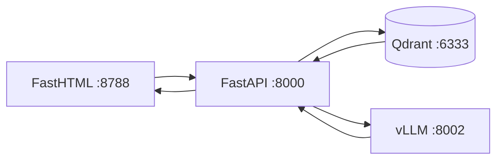

# Checkpoint 2 — Retrieval + Chat

RAG chat is wired end-to-end: **Qdrant retrieval → vLLM generation → FastHTML UI**.

**Cost: $0** — local Qdrant, local fastembed, local vLLM with a tiny model.

## Architecture



## Ports (safe alongside your other containers)

| Service | Port | Notes |
|---------|------|-------|
| Dashboard (existing) | **8787** | Do not use |
| multi-asset-scheduler | **8001** | Do not use |
| **RAG chat UI** | **8788** | FastHTML |
| **RAG API** | **8000** | FastAPI |
| **vLLM** | **8002** | Qwen2.5-0.5B (~1-2 GB VRAM) |
| **Qdrant** | **6333** | Existing rag-qdrant |

## LLM choice (low VRAM)

| Setting | Value | Why |
|---------|-------|-----|
| Model | `Qwen/Qwen2.5-0.5B-Instruct` | 0.5B params — proof-of-concept size |
| VRAM | ~1-2 GB | `--gpu-memory-utilization 0.35` |
| Max context | 2048 tokens | Keeps memory low |
| Max output | 256 tokens | Short answers |

## Start everything (3 steps)

### 0. One-time setup (fixes dependency conflicts)
```powershell
.\scripts\setup.ps1
.\.venv\Scripts\Activate.ps1
```
Use the project `.venv` — global Python may have incompatible FastAPI/Starlette versions from other projects.

### 1. vLLM (Docker, small model)
```powershell
docker compose --profile vllm up -d vllm
docker logs -f rag-vllm   # wait for "Application startup complete"
```

### 2. FastAPI backend
```powershell
.\.venv\Scripts\Activate.ps1
py -m uvicorn backend.main:app --host 127.0.0.1 --port 8000 --reload
```

### 3. FastHTML chat UI
```powershell
py -m frontend.app
```
Open: **http://127.0.0.1:8788**

## Try these questions

- "What's the difference between ENTRYPOINT and CMD?"
- "Explain Docker networking."
- "How do multi-stage builds work?"
- "What is a Kubernetes pod?"

## What happens on each question

1. **Embed query** — fastembed turns your question into a vector (local, free)
2. **Search Qdrant** — top 5 chunks from `documents` collection
3. **Build prompt** — chunks + question sent to vLLM
4. **Generate** — Qwen2.5-0.5B writes a short answer
5. **Display** — answer + source cards (title, URL, score, preview)

## Files to read (learning path)

| Order | File | What it does |
|-------|------|--------------|
| 1 | `retriever/search.py` | Embed query → Qdrant search |
| 2 | `backend/rag/pipeline.py` | Build prompt, call LLM |
| 3 | `backend/services/llm.py` | vLLM OpenAI client |
| 4 | `backend/api/routes/chat.py` | `/chat/` endpoint |
| 5 | `frontend/app.py` | UI calls API, shows sources |

## Health check

```powershell
curl http://127.0.0.1:8000/health
```

Expected:
```json
{"status": "ok", "qdrant": true, "vllm": true}
```

## API test (no UI)

```powershell
curl -X POST http://127.0.0.1:8000/chat/ -H "Content-Type: application/json" -d "{\"message\": \"What is ENTRYPOINT?\"}"
```

## Troubleshooting

| Problem | Fix |
|---------|-----|
| `network rag-project-net was found but has incorrect label` | Fixed — compose now uses `external: true`. Run `docker compose --profile vllm up -d vllm` again |
| `Router.__init__() got an unexpected keyword argument 'on_startup'` | Run `.\scripts\setup.ps1` and use `.venv` — global Starlette 1.x breaks FastAPI |
| `'functools.partial' object has no attribute 'append'` | Fixed in `frontend/app.py` — use `FastHTML(hdrs=...)` |
| `No such container: rag-vllm` | vLLM failed to start due to network error — fixed above |
| `vllm: false` in health | `docker logs -f rag-vllm` — wait for model download to finish |
| `qdrant: false` | Ensure `rag-qdrant` is running on port 6333 |
| Cannot reach API | Activate `.venv`, start uvicorn on port 8000 |
| Out of VRAM | Lower `--gpu-memory-utilization` to `0.25` in docker-compose.yml |
| Empty sources | Re-run `py -m scripts.sync_docs --skip-crawl` |

## Cost summary

| Component | Cost |
|-----------|------|
| Qdrant search | $0 |
| fastembed embeddings | $0 |
| vLLM (0.5B model) | $0 |
| FastAPI + FastHTML | $0 |

## Next (Checkpoint 3 — optional)

- Streaming responses
- Conversation history
- Better chunking / reranking
- Deploy API + UI in Docker on rag-project-net
