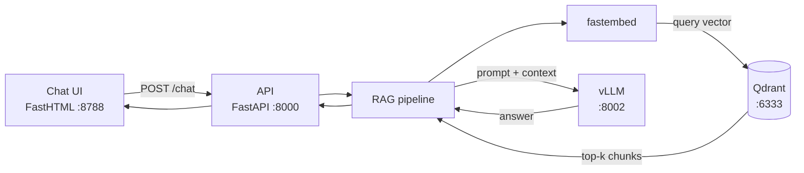
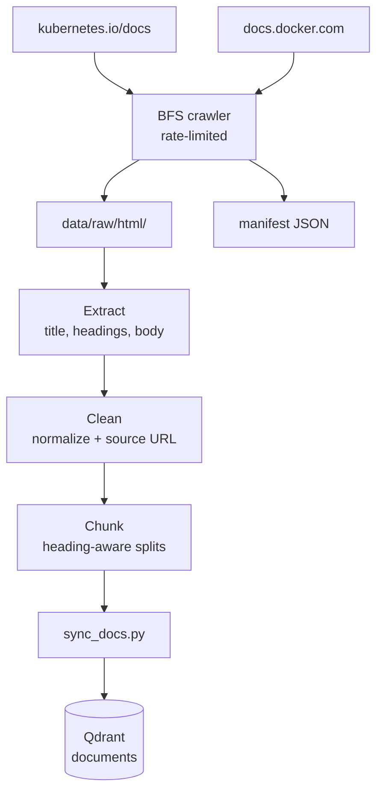
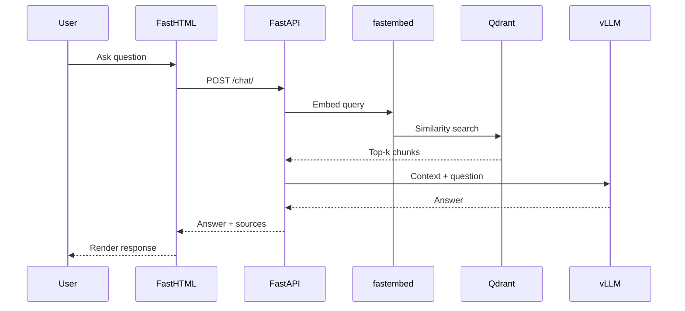
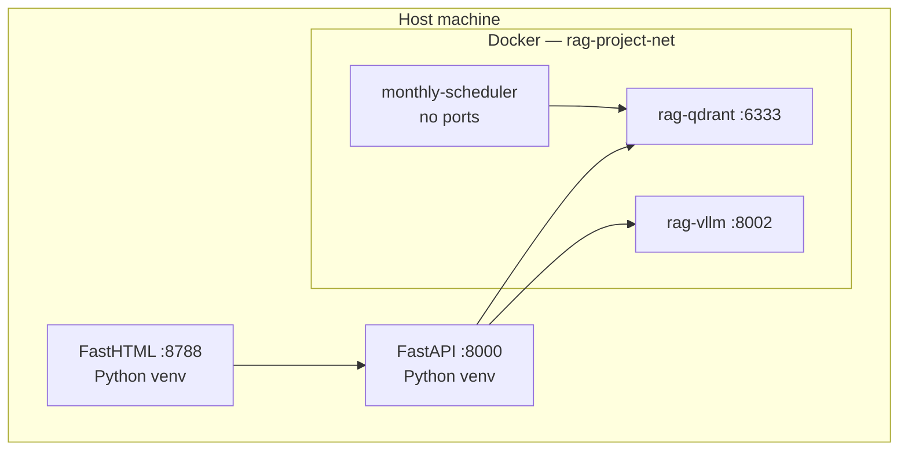

# Docker & Kubernetes RAG

A **local, zero-cost** Retrieval-Augmented Generation (RAG) system that crawls official **Docker** and **Kubernetes** documentation, indexes it in **Qdrant**, and answers questions through a **FastHTML** chat UI backed by **FastAPI** and **vLLM**.

Built as a portfolio learning project: every pipeline stage writes inspectable files, so you can follow data from raw HTML → structured JSON → chunks → vectors → LLM answers.

---

## What it does

- Crawls public docs from [docs.docker.com](https://docs.docker.com/) and [kubernetes.io/docs](https://kubernetes.io/docs/)
- Processes pages through a transparent **extract → clean → chunk** pipeline
- Embeds text locally with **fastembed** (ONNX, no API keys)
- Stores vectors in **Qdrant** and retrieves the most relevant chunks per question
- Generates answers with a small local **vLLM** model (~1–2 GB VRAM)
- Optionally refreshes the index monthly via a scheduler container

**Example questions**

- "What's the difference between ENTRYPOINT and CMD?"
- "Explain Docker networking."
- "How do multi-stage builds work?"
- "What is a Kubernetes pod?"

---

## Stack

| Layer | Technology | Role |
|-------|------------|------|
| Crawler | Python, BeautifulSoup, httpx | Fetch documentation pages |
| Processing | Custom pipeline | Extract, clean, chunk text |
| Embeddings | fastembed | Local vector generation |
| Vector DB | Qdrant | Semantic search |
| Backend | FastAPI | REST API and RAG orchestration |
| LLM | vLLM (OpenAI-compatible) | Answer generation |
| Frontend | FastHTML + HTMX | Chat UI |

---

## Quick start

**Prerequisites:** Python 3.12+, Docker Desktop, NVIDIA GPU recommended for vLLM.

```powershell
# 1. Clone, configure, install
git clone <your-repo-url>
cd RAG-project
copy .env.example .env
.\scripts\setup.ps1
.\.venv\Scripts\Activate.ps1

# 2. Start infrastructure
docker compose --profile qdrant up -d qdrant    # if not already running
docker compose --profile vllm up -d vllm
docker logs -f rag-vllm                         # wait for startup

# 3. Build the index (crawl + process + Qdrant)
py -m scripts.sync_docs --max-pages 20          # omit flag for full crawl (~100 pages/source)

# 4. Start the app (two terminals, venv activated)
py -m uvicorn backend.main:app --host 127.0.0.1 --port 8000 --reload
py -m frontend.app                              # http://127.0.0.1:8788
```

**Linux / macOS:** replace `copy` with `cp`, use `python3` instead of `py`, and `source .venv/bin/activate` instead of the PowerShell activate script.

**Health check**

```bash
curl http://127.0.0.1:8000/health
# {"status":"ok","qdrant":true,"vllm":true}
```

**Already indexed?** Skip step 3 and run only steps 2 and 4.

---

## Architecture

### System overview



### Data ingestion



### Query flow



### Deployment layout



RAG services use an isolated Docker network and avoid common local ports (`8787` dashboard, `8001` scheduler).

---

## Setup (detailed)

### Ports

| Port | Service | Notes |
|------|---------|-------|
| 6333 | Qdrant | Vector DB; dashboard at `/dashboard` |
| 8000 | FastAPI | RAG API |
| 8002 | vLLM | OpenAI-compatible endpoint |
| 8788 | FastHTML | Chat UI |

### First-time index build

Run individually or use the all-in-one sync:

```powershell
# Option A — all-in-one
py -m scripts.sync_docs

# Option B — step by step
py -m scripts.crawl_docs --source all --max-pages 20
py -m scripts.process_docs --source all
py -m scripts.sync_docs --skip-crawl

# Inspect chunks (optional)
py -m scripts.inspect_chunks --source docker --search ENTRYPOINT --limit 2
```

Processed artifacts land under `data/processed/`; vectors are stored in the Qdrant `documents` collection.

### Monthly refresh

Re-crawl and re-index on the 1st of each month (03:00 UTC):

```powershell
docker compose -f docker-compose.crawler.yml up -d monthly-scheduler
```

One-off sync inside Docker (no host ports published):

```powershell
docker compose -f docker-compose.crawler.yml run --rm doc-sync
```

Kubernetes alternative: `kubectl apply -f k8s/data-pvc.yaml` then `kubectl apply -f k8s/crawler-cronjob.yaml`.

---

## Project structure

```
RAG-project/
├── backend/           # FastAPI — /health, /chat, RAG pipeline
├── frontend/          # FastHTML chat UI (HTMX partial updates)
├── crawler/           # Doc crawler (Docker + Kubernetes sources)
├── processing/        # extract → clean → chunk pipeline
├── retriever/         # Qdrant client, search, chunk indexing
├── scripts/           # CLI: crawl, process, sync, inspect
├── docker/            # Crawler container image
├── k8s/               # CronJob manifests
├── data/              # Generated at runtime (gitignored)
├── docker-compose.yml           # Qdrant + vLLM
└── docker-compose.crawler.yml   # Monthly scheduler
```

---

## Configuration

Copy `.env.example` to `.env`:

| Variable | Default | Description |
|----------|---------|-------------|
| `QDRANT_COLLECTION` | `documents` | Qdrant collection name |
| `VLLM_BASE_URL` | `http://localhost:8002/v1` | vLLM endpoint |
| `VLLM_MODEL` | `Qwen/Qwen2.5-0.5B-Instruct` | Small local model |
| `EMBEDDING_MODEL` | `BAAI/bge-small-en-v1.5` | fastembed model |
| `CHUNK_SIZE` / `CHUNK_OVERLAP` | `800` / `120` | Chunking settings |
| `TOP_K` | `5` | Chunks retrieved per query |
| `RAG_TOP_K` | `3` | Chunks sent to LLM (small context window) |
| `RAG_MAX_CONTEXT_CHARS` | `2800` | Max retrieved context size |
| `RAG_MAX_OUTPUT_TOKENS` | `160` | Max LLM response length |
| `FRONTEND_PORT` | `8788` | Chat UI port |

---

## Development

```powershell
py -m pytest tests/ -q
```

Direct API test:

```bash
curl -X POST http://127.0.0.1:8000/chat/ \
  -H "Content-Type: application/json" \
  -d '{"message": "What is ENTRYPOINT?"}'
```

---

## Troubleshooting

| Problem | Fix |
|---------|-----|
| FastAPI startup error (`on_startup`) | Use the project `.venv` — global Starlette can conflict |
| `qdrant: false` in `/health` | `docker compose --profile qdrant up -d qdrant` |
| `vllm: false` in `/health` | `docker logs -f rag-vllm` — wait for model load |
| No search results | Re-index: `py -m scripts.sync_docs --skip-crawl` |
| Chat UI shows no answer | Confirm API on :8000; restart frontend |
| Out of VRAM | Lower `--gpu-memory-utilization` in `docker-compose.yml` |

---

## Cost

| Component | Cost |
|-----------|------|
| Doc crawling | $0 — public HTTP |
| Embeddings (fastembed) | $0 — local ONNX |
| Qdrant | $0 — local Docker |
| vLLM | $0 — local GPU |

---

## License

MIT
