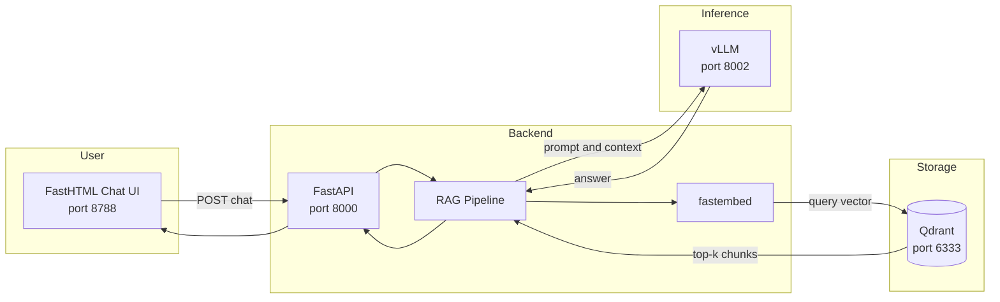
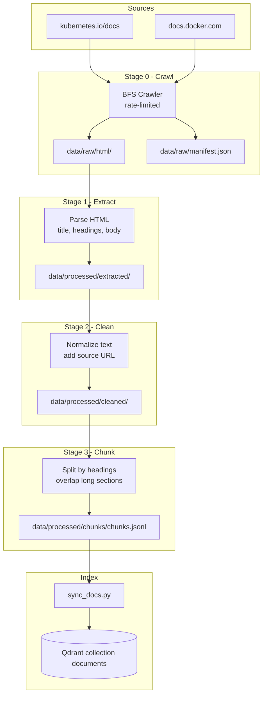
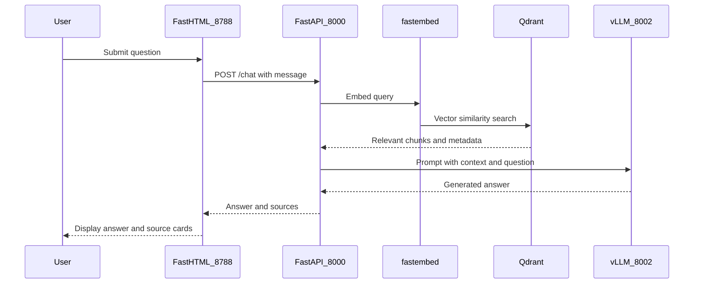
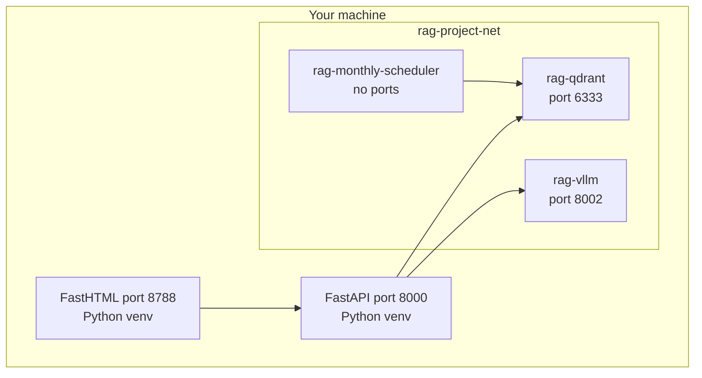

# RAG-project

A local, **zero-cost** Retrieval-Augmented Generation (RAG) system that crawls **Kubernetes** and **Docker** documentation, indexes it in **Qdrant**, and answers questions via a **FastHTML** chat UI backed by **FastAPI** and **vLLM**.

Built as a learning project — every stage writes inspectable files so you can follow the data from raw HTML to vector search to LLM response.

## Features

- **Free data sources** — public docs at [kubernetes.io/docs](https://kubernetes.io/docs/) and [docs.docker.com](https://docs.docker.com/)
- **Polite crawler** — rate-limited, respects `robots.txt`, BFS link discovery
- **Transparent pipeline** — extract → clean → chunk with JSON artifacts at each stage
- **Local embeddings** — [fastembed](https://github.com/qdrant/fastembed) (ONNX, no API keys)
- **Local vector store** — [Qdrant](https://qdrant.tech/) in Docker
- **Local LLM** — [vLLM](https://github.com/vllm-project/vllm) with a small model (~1–2 GB VRAM)
- **Monthly refresh** — optional scheduler re-crawls and re-indexes docs

## Stack

| Layer | Technology | Role |
|-------|------------|------|
| Crawler | Python + BeautifulSoup + httpx | Fetch documentation pages |
| Processing | Custom pipeline | Extract, clean, chunk text |
| Embeddings | fastembed | Turn text into vectors (local) |
| Vector DB | Qdrant | Store and search embeddings |
| Backend | FastAPI | REST API, RAG orchestration |
| LLM | vLLM (OpenAI-compatible) | Generate answers from retrieved context |
| Frontend | FastHTML + HTMX | Chat UI |

## How it works

### System overview

When you ask a question in the chat UI, the system retrieves relevant doc chunks from Qdrant and sends them to a local LLM as context.



### Data ingestion pipeline

Documentation is crawled once (or monthly), processed through three stages, then embedded and stored in Qdrant.



### RAG query flow (one question)



### Deployment layout (Docker)

RAG services use an isolated Docker network. Only Qdrant and vLLM publish ports.



## Prerequisites

| Requirement | Notes |
|-------------|-------|
| **Python 3.12+** | Use a project virtualenv (required — avoids dependency conflicts) |
| **Docker Desktop** | For Qdrant and vLLM |
| **NVIDIA GPU** | Recommended for vLLM; ~2 GB VRAM for the default small model |
| **Git** | Clone the repository |

### Port reference

| Port | Service | Notes |
|------|---------|-------|
| 6333 | Qdrant | Vector database UI at `/dashboard` |
| 8000 | FastAPI | RAG API |
| 8002 | vLLM | OpenAI-compatible endpoint (avoid 8001 if already in use) |
| 8788 | FastHTML | Chat UI (avoid 8787 if already in use) |

## Installation

### 1. Clone and configure

```bash
git clone <your-repo-url>
cd RAG-project
cp .env.example .env   # Linux/macOS
# copy .env.example .env   # Windows
```

Edit `.env` if you need to change ports or the Qdrant host.

### 2. Create virtual environment

**Windows (PowerShell):**

```powershell
.\scripts\setup.ps1
.\.venv\Scripts\Activate.ps1
```

**Linux / macOS:**

```bash
python -m venv .venv
source .venv/bin/activate
pip install -r requirements.txt
```

> Always activate `.venv` before running Python commands. Global Python may have incompatible package versions.

### 3. Start Qdrant

If you don't already have a Qdrant container:

```bash
docker compose --profile qdrant up -d qdrant
```

Verify: http://127.0.0.1:6333/dashboard

## Running locally

### Option A — Full setup (first time)

Run these in order. Steps 1–4 build the index; steps 5–7 start the chat.

#### Step 1: Crawl documentation

```bash
python -m scripts.crawl_docs --source all --max-pages 20
```

Increase `--max-pages` (default 100) for a larger corpus.

#### Step 2: Process (extract → clean → chunk)

```bash
python -m scripts.process_docs --source all
```

#### Step 3: Index into Qdrant

```bash
python -m scripts.sync_docs --skip-crawl
```

Or run crawl + process + index in one command:

```bash
python -m scripts.sync_docs
```

#### Step 4: Inspect chunks (optional)

```bash
python -m scripts.inspect_chunks --source docker --search ENTRYPOINT --limit 2
```

#### Step 5: Start vLLM

```bash
docker compose --profile vllm up -d vllm
docker logs -f rag-vllm   # wait for "Application startup complete"
```

Default model: `Qwen/Qwen2.5-0.5B-Instruct` (~1 GB download, ~1–2 GB VRAM).

#### Step 6: Start the API

```bash
python -m uvicorn backend.main:app --host 127.0.0.1 --port 8000 --reload
```

#### Step 7: Start the chat UI

In a **second terminal** (with `.venv` activated):

```bash
python -m frontend.app
```

Open **http://127.0.0.1:8788**

### Option B — Quick chat (index already built)

If you already ran sync and have data in Qdrant:

```bash
docker compose --profile vllm up -d vllm
python -m uvicorn backend.main:app --host 127.0.0.1 --port 8000 --reload
python -m frontend.app
```

### Example questions

- "What's the difference between ENTRYPOINT and CMD?"
- "Explain Docker networking."
- "How do multi-stage builds work?"
- "What is a Kubernetes pod?"

## Health checks

```bash
curl http://127.0.0.1:8000/health
```

Expected when everything is running:

```json
{"status": "ok", "qdrant": true, "vllm": true}
```

Test the chat API directly:

```bash
curl -X POST http://127.0.0.1:8000/chat/ \
  -H "Content-Type: application/json" \
  -d '{"message": "What is ENTRYPOINT?"}'
```

## Monthly doc refresh

Keep the index up to date with a scheduler container (no published ports):

```bash
docker compose -f docker-compose.crawler.yml up -d monthly-scheduler
```

Runs on the **1st of each month at 03:00 UTC**: crawl → process → recreate Qdrant collection → re-index.

**Kubernetes alternative:**

```bash
kubectl apply -f k8s/data-pvc.yaml
kubectl apply -f k8s/crawler-cronjob.yaml
```

## Project structure

```
RAG-project/
├── backend/                  # FastAPI application
│   ├── main.py               # App entry, CORS
│   ├── api/routes/           # /health, /chat, /documents
│   ├── core/config.py        # Settings from .env
│   ├── models/schemas.py     # Pydantic request/response models
│   ├── services/
│   │   ├── embeddings.py     # fastembed wrapper
│   │   └── llm.py            # vLLM OpenAI client
│   └── rag/pipeline.py       # Retrieve → prompt → generate
│
├── frontend/                 # FastHTML chat UI
│   ├── app.py                # Routes, API proxy
│   └── components/chat.py    # Form, results, HTMX
│
├── crawler/                  # Documentation crawler
│   ├── config.py             # Sources, seeds, rate limits
│   ├── fetcher.py            # HTTP + robots.txt
│   ├── parser.py             # HTML extraction
│   └── crawl.py              # BFS orchestrator
│
├── processing/               # Data pipeline
│   ├── extract.py            # HTML → JSON
│   ├── clean.py              # Text normalization
│   ├── chunk.py              # Chunking for retrieval
│   └── pipeline.py           # Stage orchestration
│
├── retriever/                # Qdrant integration
│   ├── client.py             # Vector store wrapper
│   ├── search.py             # Semantic search
│   └── chunk_loader.py       # Index chunks.jsonl
│
├── scripts/                  # CLI entry points
│   ├── crawl_docs.py
│   ├── process_docs.py
│   ├── sync_docs.py          # Full sync → Qdrant
│   ├── inspect_chunks.py
│   └── setup.ps1             # Windows venv setup
│
├── data/                     # Generated at runtime (gitignored)
│   ├── raw/html/             # Crawled HTML
│   └── processed/            # extracted → cleaned → chunks
│
├── docker/                   # Container images
├── k8s/                      # Kubernetes CronJob manifests
├── docker-compose.yml        # Qdrant + vLLM
├── docker-compose.crawler.yml # Monthly scheduler
├── CHECKPOINT.md             # Learning guide: data pipeline
├── CHECKPOINT2.md            # Learning guide: retrieval + chat
└── requirements.txt
```

## Configuration

Copy `.env.example` to `.env`:

| Variable | Default | Description |
|----------|---------|-------------|
| `QDRANT_HOST` | `localhost` | Qdrant hostname (`rag-qdrant` inside Docker network) |
| `QDRANT_PORT` | `6333` | Qdrant REST port |
| `QDRANT_COLLECTION` | `documents` | Collection name |
| `VLLM_BASE_URL` | `http://localhost:8002/v1` | vLLM OpenAI-compatible endpoint |
| `VLLM_MODEL` | `Qwen/Qwen2.5-0.5B-Instruct` | Small local model |
| `EMBEDDING_MODEL` | `BAAI/bge-small-en-v1.5` | fastembed model |
| `CHUNK_SIZE` | `800` | Characters per chunk |
| `CHUNK_OVERLAP` | `120` | Overlap between chunks |
| `TOP_K` | `5` | Chunks retrieved per query |
| `API_BASE_URL` | `http://127.0.0.1:8000` | Used by frontend |
| `FRONTEND_PORT` | `8788` | Chat UI port |

## Development

### Run tests

```bash
python -m pytest tests/ -q
```

### Lint / format (optional)

Add your preferred tools (`ruff`, `black`, etc.) as needed.

## Troubleshooting

| Problem | Solution |
|---------|----------|
| `Router.__init__() got an unexpected keyword argument 'on_startup'` | Use the project `.venv` — global Starlette 1.x breaks FastAPI |
| `network rag-project-net ... incorrect label` | Compose uses `external: true`; network must exist from a prior run |
| Chat page shows no answer | Restart frontend after updates; ensure API is on port 8000 |
| `vllm: false` in `/health` | Run `docker logs -f rag-vllm` and wait for model load |
| `qdrant: false` | Start Qdrant: `docker compose --profile qdrant up -d qdrant` |
| Out of VRAM | Lower `--gpu-memory-utilization` in `docker-compose.yml` (e.g. `0.25`) |
| Empty search results | Re-index: `python -m scripts.sync_docs --skip-crawl` |

## Learning guides

| Checkpoint | Topic | File |
|------------|-------|------|
| 1 | Crawl → process → Qdrant | [CHECKPOINT.md](CHECKPOINT.md) |
| 2 | Retrieval + chat + vLLM | [CHECKPOINT2.md](CHECKPOINT2.md) |

## Cost

| Component | Cost |
|-----------|------|
| Doc crawling | $0 (public HTTP) |
| Embeddings (fastembed) | $0 (local ONNX) |
| Qdrant | $0 (local Docker) |
| vLLM | $0 (local GPU) |

## License

MIT (or update to match your preference before publishing).
