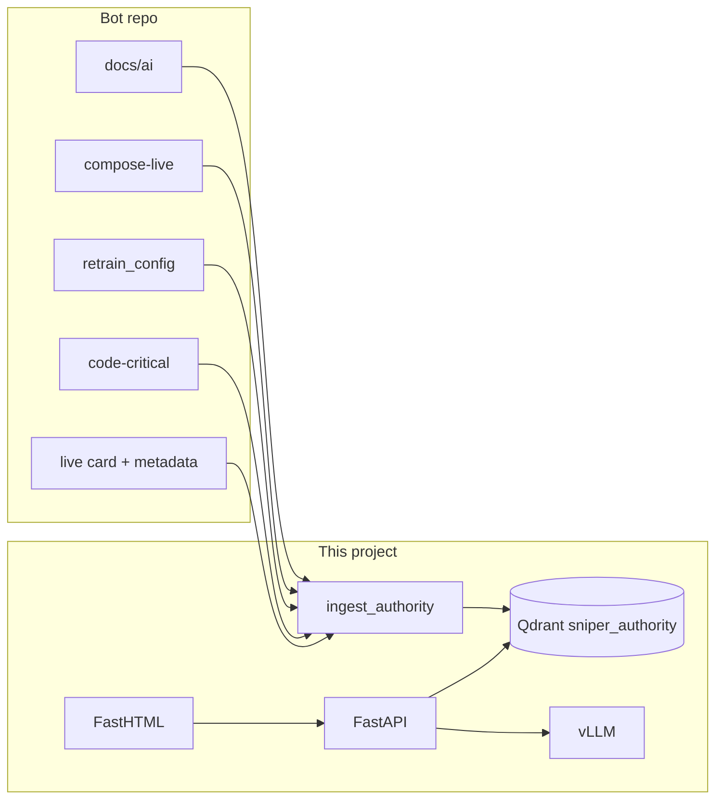

# Sniper Bot Authority RAG

Local, **zero-cost** RAG for the **AI Sniper Bot** (SOL/LTC multi-asset ML trading).  
Authority for train/serve parity, deploy gates, live flags, feature contracts, and measurement rules.

Embeddings: **fastembed** (local ONNX, no API keys). Vector store: **Qdrant**. Optional LLM: local **vLLM**.

---

## How it works



### Conflict rule

1. Local sniper-bot chunks are the only truth for bot behaviour.
2. If no local hit → say **unknown / verify in code**.
3. Citations required: `namespace` + `source_path`.

### Namespaces (default retrieve)

| Namespace | Content |
|-----------|---------|
| `docs-ai` | `docs/ai/*.md` |
| `compose-live` | `docker-compose.multi_asset.yml` |
| `config-train` | `workflows/config/retrain_config.yaml` |
| `contracts` | feature contracts SOL/LTC |
| `code-critical` | parity / footing / gates slices |
| `state-live` | deployment metadata, footing, promotion, live card |
| `tests-parity` | encode/footing tests |

Opt-in only: `handoff-secondary`, `web-generic`, `footgun`.

---

## Prerequisites

- Python 3.12+
- Compose runtime for Qdrant (+ optional vLLM)
- Bot repo path: `C:\Users\jacob\Desktop\AI_sniper_bot_sol\AI_sniper_bot_sol_base`

| Port | Service |
|------|---------|
| 6333 | Qdrant |
| 8000 | FastAPI |
| 8002 | vLLM (optional) |
| 8788 | Chat UI |

Avoid colliding with the live sniper dashboard (:8787) and scheduler API (:8001).

---

## Setup

```powershell
cd RAG-project
copy .env.example .env
# Confirm BOT_REPO_ROOT

.\scripts\setup.ps1
.\.venv\Scripts\Activate.ps1
```

Start Qdrant (`rag-qdrant` on 6333).

### Ingest

```powershell
python -m scripts.ingest_authority --dry-run
python -m scripts.ingest_authority
python -m scripts.generate_live_card
```

### Run chat

```powershell
docker compose --profile vllm up -d vllm   # optional
python -m uvicorn backend.main:app --host 127.0.0.1 --port 8000 --reload
python -m frontend.app                      # http://127.0.0.1:8788
```

---

## Manifest

See [`ingest_manifest.yaml`](ingest_manifest.yaml).

| Path | Role |
|------|------|
| `authority/` | Manifest, chunkers, code slices, live card, router, prompts |
| `scripts/ingest_authority.py` | Index → Qdrant |
| `scripts/generate_live_card.py` | Rebuild live card |
| `scripts/wipe_legacy.py` | Clear old local/Qdrant data |

---

## Acceptance prompts

See [ACCEPTANCE.md](ACCEPTANCE.md).

```powershell
python -m pytest tests/test_authority.py -q
```

---

## Cost

| Component | Cost |
|-----------|------|
| Local bot-repo ingest | $0 |
| fastembed | $0 |
| Qdrant | $0 |
| vLLM | $0 |
